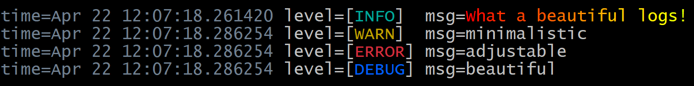

## Concept
> Realization of slog handlers for filtering logs and coloring logs



## Usecase
Defining the slog.Logger -> integrate handler
```go
handler := slogslav.NewFilterTextHandler(os.Stdout, nil, nil)
logger := slog.New(handler)

// common logger using
```
Interface:
```go
func NewFilterTextHandler(w io.Writer, opts *slog.HandlerOptions, level slog.Level) *FilterHandler {}
func NewFilterJSONHandler(w io.Writer, opts *slog.HandlerOptions, level slog.Level) *FilterHandler {}
func NewColorfulTextHandler(out io.Writer, formatter ColorFormatter, handlerOpts *slog.HandlerOptions) *ColorfulHandler {}
```
## Individualizing the logs
##### Use **ColorFormatter**
```go
type ColorFormatter interface {
	Err(level slog.Level) string
	Warn(level slog.Level) string
	Debug(level slog.Level) string
	Info(level slog.Level) string
	Time(logtime string) string
	Separator() string
}
```
`Err`, `Warn`, `Debug`, `Info`, `Time`, `Separator` - are used in writing into io.Writer interface. Anything that implements this interface may be used as ColorFormatter \
The default implementation is ColorFormatterPalette
```go
type ColorFormatterPalette struct {
	err       *color.Color
	warn      *color.Color
	debug     *color.Color
	info      *color.Color
	time      *color.Color
	separator byte
}
```
It uses fatih/color
##### Use HandlerOptions
Described in slog manuals